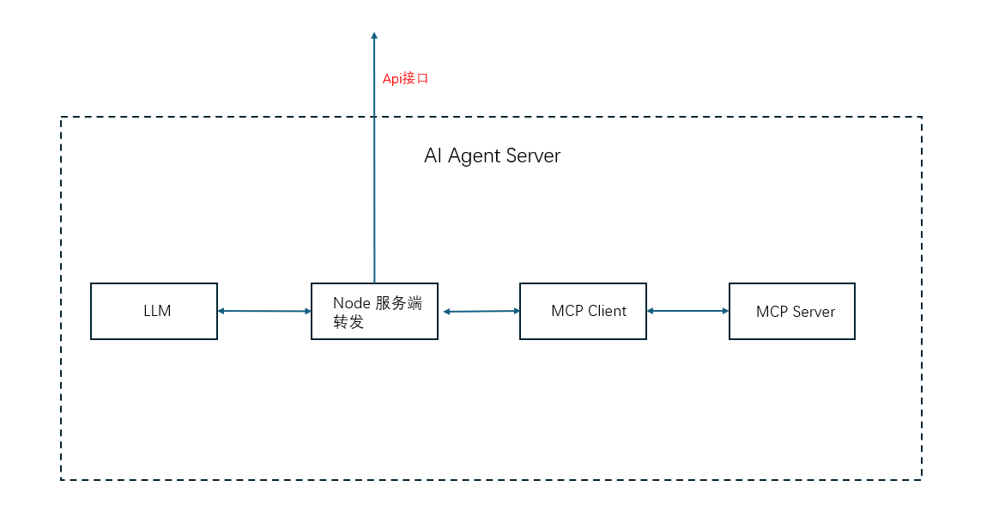

### nest-llm-aigent
1. **背景**  
随着 MCP（Model Context Protocol）服务的推出，它为模型上下文通信和工具统一管理提供了极大的灵活性。通过开发的 MCP Server，可以高效对接各类客户端，可以实现一次开发处处运行。然而，如何将 MCP Server 无缝集成到现有的 Web 服务中并方便部署，成为了许多开发者关注的关键问题。



2. **目标**  
- **轻松集成**：适配层可以快速对接现有的 Web 服务（如基于 NestJS 构建的服务）。
- **无缝扩展**：通过私有 NPM 包的形式，实现 MCP Server 的快速集成与统一管理，保持 MCP Server 的高度可移植性。
- **便捷部署**：通过私有 NPM 包，实现 MCP Server 的集中管理和版本控制，无缝集成到现有的发布流程中，方便部署。
- **未来发展**：支持 WebSocket 协议，增加双向交互及实时性。

3. **接口定义**  
为了满足不同场景下的功能需求，设计了以下标准化的接口：

| 功能                      | HTTP 方法 | 路径                   | 描述                          |
|---------------------------|-----------|------------------------|-------------------------------|
| 获取所有工具               | POST      | /api/mcp/tools             | 获取所有工具列表              |
| 获取function calls工具               | POST      | /api/mcp/functools             | 获取openai function call 定义              |
| 调用 MCP 工具              | POST      | /api/mcp/tools/call        | 调用 MCP 工具                 |
| 获取资源列表               | POST      | /api/mcp/resources         | 获取所有资源                  |
| 获取所有提示               | POST      | /api/mcp/prompts           | 获取所有提示                  |
| 获取所有工具、资源、提示词 | POST      | /api/mcp/all               | 返回格式：`{tools:[],resources:[],prompts:[]}` |
| 调用llm接口 | POST      | /api/mcp/agent               | 输入格式：messages:["role":"user","content":"你的问题"]，返回messages |

4. **示例**  
.....

5. **MCP Servers 部署方式**  
推荐将 MCP Server 集成部署，以提高灵活性与统一管理能力。建议以下方案：
- **私有 NPM 包**：将 MCP Server 打包为 NPM 包，结合企业私有 NPM 仓库进行分发管理。
- **安装与配置**：通过 `npm install` 直接安装 MCP Server 包，并通过配置文件（如 `mcp.config.json`）实现快速集成。

**示例配置文件 mcp.config.json**：
```json
{
  "mcpServers": {
    "server1": {
      "name": "example-server",
      "args": ["server.js"],
      "path": "./servers/server1/"
    }
  },
  "mcpClient": {
    "name": "mcp-client",
    "version": "1.0.0"
  }
}
```

6. **未来**  
- 目前mcp server sse协议 server只做了stdio 。
-  请求时上下文协议及全局变量可以在接口层、mcp client层、mcp server层共享。
- 目前支持http接口，最好未来可以把这些接口封装成一个socket，更有利于聊天场景。
- 写完后，其实有另外一个想法，就是能不能基于mcp 原始协议，写一个公共类，对于基于类写的mcp server,编译后不仅支持mcp client的调用，也可以支持引入模块后的，函数调用。这可能是另外一个项目。
- 大概花了1天时间，完成了这个项目，时间有点紧张，后续有时间再完善。

